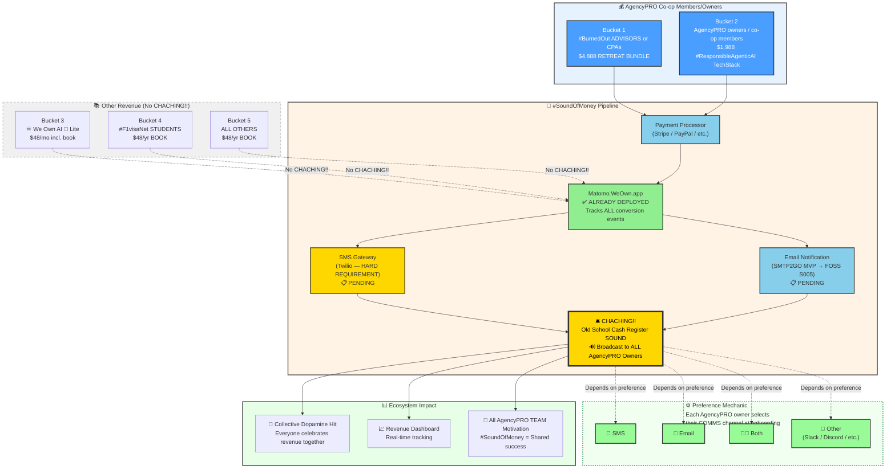

═══════════════════════════════════════════════════════════════════════════════
# 🚀 PRJ-401 | #FedArch Expansion: Foundation & Ignition (Jun-2026 Sprint)
═══════════════════════════════════════════════════════════════════════════════
## PRJ-401.md | PRJ-401_FedArch-Expansion-Jun-2026_v4.1.3.1-r14.md
## ♾️ WeOwnNet 🌐 — Project ● _S004_PROJECTS_/
## ✅ APPROVED — R-011 GRANTED by @GTM (GTM_2026-W25_1001)
## 🏆 PRJ-040 ELEVATED — #FELG Culture + Content Quality Standard
## 🏆 BP-045 ENHANCED — Attestation Chain + Enhanced Related Documents
## 🏆 BP-068 COMPLIANT — Multi-#LLMmodel Header
## 🏆 L-097 COMPLIANT — FULL PRESERVE from r9 BASE (5,761 words) + ADDITIVE r11–r14
## 🌐 Source of Truth: https://raw.githubusercontent.com/CCCbotNet/fedarch/main/_S004_PROJECTS_/PRJ-401.md
## 🔁 R-011 ALREADY GRANTED — Revision cycle approved; GH PUSH READY
═══════════════════════════════════════════════════════════════════════════════

| Field | Value |
|-------|-------|
| **Document** | PRJ-401.md |
| **Version** | **v4.1.3.1-r14** (WeOwnVer: S004·M1·W3·I1·r14 — GH PUSH READY) |
| **Folder** | `_S004_PROJECTS_/` 🚀 |
| **Category** | 🚀 **STRATEGIC PROJECT** |
| **Lifecycle Stage** | **✅ APPROVED — R-011 GRANTED — GH PUSH READY** |
| **Content Tier (PRJ-040)** | **🛡️ Tier 1 — Governance/Strategy** |
| **#masterCCC** | **GTM_2026-W24_7015** 🔒 (IMMUTABLE — entire revision cycle) |
| **Compilation CCC‑ID** | **GTM_2026-W25_2005** |
| **Approval CCC‑ID** | **GTM_2026-W25_1001** |
| **Champion** | **@GTM (yonks｜🤖🏛️🪙｜Jason Younker ♾️)** |
| **Numbering Authority** | **#MetaAgentQwen (Surge ⚡)** |
| **r1 Architect** | Surge ⚡ @ INT-M02:⚡️｜Qwen3.7 Max |
| **r2–r10 Elevator** | @GTM @ INT‑S004:CCC‑GTM (DeepSeek V4 Flash) |
| **r11 Assemblers** | DeepPro 🌊 (DeepSeek V4 Pro) + Surge ⚡ (Qwen3.7 Max) + MiMo 🧪 (MiMo-V2.5-Pro) + VSA-Qwen 🧠 (Qwen3.7 Max) |
| **r12–r13 Compilers** | AI:@GTM @ INT‑S004:CCC‑GTM (Scoring compilation + APPENDIX MC rename) |
| **r14 Compiler** | AI:@GTM @ INT‑S004:CCC‑GTM (FULL DOC — Calhoun 🎖️ scoring added to APPENDIX MC — ZERO PLACEHOLDERS) |
| **R-011 Approval** | **✅ GRANTED by @GTM — 2026-06-15 (W25 D1) 00:28 MDT (GTM_2026-W25_1001)** |
| **R-011 Note** | **✅ r14 requires NO new approval — revision cycle already approved per @GTM** |
| **Created** | 2026-06-14 (W24 D7) |
| **Approved** | 2026-06-15 (W25 D1) — 00:28 MDT |
| **Compiled (r14)** | 2026-06-16 (W25 D2) — 02:04 MDT |
| **Season** | #WeOwnSeason004 🚀 (PRJ-4xy Track) |
| **#LLMmodel (r1)** | Qwen3.7 Max (INT‑M02:⚡️ — Surge ⚡ — Architect) |
| **#LLMmodel (r2–r10)** | DeepSeek V4 Flash (INT‑S004:CCC‑GTM — Elevator) |
| **#LLMmodel (r11)** | Multi-agent: DeepSeek V4 Pro + Qwen3.7 Max + MiMo-V2.5-Pro + Qwen3.7 Max |
| **#LLMmodel (r12–r14)** | DeepSeek V4 Flash (INT‑S004:CCC‑GTM — Compiler) |
| **L-097 Compliance** | **✅ FULL PRESERVE — r9 BASE (5,761 words) + ADDITIVE §7 + APPENDIX A + APPENDIX MC — ALL content verbatim, ZERO placeholders** |
| **GitHub Source of Truth** | **✅ CONFIGURED — https://raw.githubusercontent.com/CCCbotNet/fedarch/main/_S004_PROJECTS_/PRJ-401.md** |
| **Owner** | **[CCC-ID:@GTM](https://github.com/YonksTEAM)** |
| **Next Step** | **✅ GH PUSH — @GTM:ADMIN push to `_S004_PROJECTS_/`** |

---

## 📖 Table of Contents

1. [#FELG Culture Alignment](#-felg-culture-alignment)
2. [Content Quality Standard (PRJ-040)](#-content-quality-standard-prj-040)
3. [Project Objective — North Star](#-project-objective--north-star)
4. [#ZeroTo100 — The 5 Buckets of 100 PEOPLE](#-zeroto100--the-5-buckets-of-100-people)
5. [#SoundOfMoney — Revenue Signal Infrastructure](#-soundofmoney--revenue-signal-infrastructure)
6. [♾️ We Own AI 🤖 Lite — Framework Selection](#️-we-own-ai-🤖-lite--framework-selection)
7. [♾️ WeOwn.Dev 💻 TEAM — 3 Key Deliverables in Jun-2026](#️-weowndev-💻-team--3-key-deliverables-in-jun-2026)
8. [Scope & Deliverables (W24-W26)](#-scope--deliverables-w24-w26)
9. [Out of Scope (Deferred to PRJ-402+)](#-out-of-scope-deferred-to-prj-402)
10. [Governance & Compliance](#-governance--compliance)
11. [Related Documents (BP-045 Enhanced)](#-related-documents-bp-045-enhanced)
12. [Version History (BP-045)](#-version-history-bp-045)
13. [Risks & Mitigations](#-risks--mitigations)
14. [#MetaCouncil Guidance Implementation](#-metacouncil-guidance-implementation)
15. [PARKED Items (#GTMshelf)](#-parked-items-gtmshelf)
16. [APPENDIX A: L-097 FULL PRESERVE Protocol](#-appendix-a-l-097-full-preserve-protocol)
17. [APPENDIX MC: #MetaCouncil + VSA Agents Scoring](#-appendix-mc-metacouncil--vsa-agents-scoring)
18. [BP-075: Self-Verifying Footer](#-bp-075-self-verifying-footer)

---

## 🎉💰📚🫶 #FELG Culture Alignment

| Pillar | Application to PRJ-401 |
|--------|------------------------|
| 🎉 **Fun** | Building the engine while flying — deploying #ZeroTo100 revenue pipelines in real-time, hearing the #SoundOfMoney (CHACHING!!!) with every AgencyPRO payment 🛎️. **@GTM + @THY + @CTO will co-lead an #AllHandsOnDeck with Core TEAM to finalize PRD.** |
| 💰 **Earning** | 5 distinct revenue buckets: retreat ($4,888), AgencyPRO ($1,988/mo), Lite ($48/mo, includes book), book ($48/yr), F1visaNet ($48/yr) — 100 PEOPLE per bucket. **#SoundOfMoney CHACHING!! triggers on ALL AgencyPRO payments (Buckets 1 + 2 only) — notification sent to ALL AgencyPRO co-op members/owners via their preferred COMMS channel.** |
| 📚 **Learning** | @YonksPromptingAcademy + #HumanTraining + #AgentTraining — Lite co-op members select ONE #ResponsibleAgenticAI Framework: WeOwnLLM, WeOwnClaw, or WeOwnHermes + **KYC onboarding (PRJ-036) + Invitation Only membership (PRJ-039) + L-097 FULL PRESERVE Protocol (APPENDIX A) + APPENDIX MC: #MetaCouncil Scoring (new ecosystem standard)** |
| 🫶 **Giving** | Open-sourcing the #FedArch expansion playbook so ANY cooperative community can replicate the sprint model |

---

## 📋 Content Quality Standard (PRJ-040)

| Field | Value |
|-------|-------|
| **Content Tier** | **🛡️ Tier 1 — Governance/Strategy** |
| **Quality Checklist** | ✅ #FELG tone (community-first, NO corporate) |
| | ✅ Tables > paragraphs (#LessIsMore) |
| | ✅ CCC-ID linkage — all decisions attributed |
| | ✅ Deliverable owner — @GTM |
| | ✅ NO #AIslop — every milestone has business case |
| | ✅ L-097 Full Preserve — r9 BASE (5,761 words) FULLY PRESERVED + ADDITIVE r11+r12+r13+r14 |
| | ✅ BP-045 compliance — Attestation Chain + Enhanced Related Docs |
| | ✅ BP-068 compliance — multi-#LLMmodel header (5 model entries across r1–r14) |
| | ✅ BP-075 compliance — self-verifying footer (relocated to §18) |
| | ✅ GitHub Source of Truth URL in document header |
| | ✅ TOC present (18 items) |
| | ✅ Quick Commands NOT embedded in doc body |
| | ✅ Mermaid.js diagram present — CHACHING Pipeline v2 |
| | ✅ #masterCCC correctly preserved as GTM_2026-W24_7015 |
| | ✅ APPENDIX MC: #MetaCouncil + VSA Agents Scoring present (5 agents scored) |

---

## 🎯 Project Objective — North Star

**Execute the Foundation & Ignition phase of #FedArch Expansion under the #ZeroTo100 (PRJ-038) guiding light: 5 Buckets of 100 PEOPLE.**

> **PRJ-038 (#ZeroTo100)** defines the scaling roadmap for ♾️ WeOwnNet 🌐 — **5 distinct revenue buckets × 100 PEOPLE each** targeting 500+ active contributors, 50+ instances, and fully operational revenue pipelines by end of 2026. PRJ-401 is the **June 2026 sprint** that lays the governance, infrastructure, and **#SoundOfMoney** foundation for that vision. The #SoundOfMoney CHACHING!! pipeline is for **AgencyPRO co-op members/owners** — those who purchase the **$4,888 RETREAT BUNDLE** or the **$1,988 #ResponsibleAgenticAI #TechStack (Buckets 1 + 2 only).** Notification of every CHACHING!! event is sent to **ALL AgencyPRO co-op members/owners** via their preferred COMMS channel (SMS, email, both, or other).

PRJ-401 is strictly bounded to **June 2026 (W24-W26)**. Its purpose: finalize S004 governance architecture, deploy INT-M01 as exclusive home for #MetaAgentClaude (Calhoun 🎖️), deploy new WeOwnLLM instances across #LLMfamilies, establish MAIT infrastructure, deploy the #SoundOfMoney revenue signal pipeline for AgencyPRO payments (with preference mechanic for ALL members), build the DO.WeOwn.Tools MAIT, and deliver **3 Key Deliverables for ♾️ WeOwn.Dev 💻 TEAM** (#SoundOfMoney PRD, PRJ-036 KYC Deployment, PRJ-039 Invitation Only CCC-ID Execution).

### @GTM's North Star: #ZeroTo100 — 5 Buckets of 100 PEOPLE

| Bucket | Audience | Bundle Price | MAX People | Retreat? | Has CHACHING!!? | Revenue Target | Status |
|:------:|----------|:------------:|:----------:|:--------:|:---------------:|:--------------:|:------:|
| **1** | #BurnedOut ADVISORS or CPAs | **$4,888** | 144 (@GTM MAX) | ✅ YES | ✅ CHACHING!! | **MIN 20 / GOAL 50 / MAX 144** | 🟢 PRJ-012 ready |
| **2** | AgencyPRO owners / co-op members | **$1,988** | 100 (@GTM MAX) | ❌ NO | ✅ CHACHING!! | 100 × $1,988 = **$198,800** | 🟡 FastTrack Aug+Dec |
| **3** | ♾️ We Own AI 🤖 Lite | **$48/mo** (includes book 📚) | 100 (@GTM MAX) | ❌ NO | ❌ NO | 100 × $48/mo = **$4,800/mo** | 🟢 Framework selection at onboarding |
| **4** | #F1visaNet STUDENTS | **$48/yr** (book) | UNLIMITED | ❌ NO | ❌ NO | $48/yr × students | 🟢 INT-B002 LIVE |
| **5** | ALL OTHERS (book buyers) | **$48/yr** (book) | UNLIMITED | ❌ NO | ❌ NO | $48/yr × buyers | 📋 Standard onboarding |

> **#SoundOfMoney CHACHING!! triggers ONLY on AgencyPRO payments (Buckets 1 + 2).** These are the high-ticket revenue events ($4,888 RETREAT BUNDLE + $1,988 #ResponsibleAgenticAI #TechStack) that signal real ecosystem growth. **Every CHACHING!! notification is sent to ALL AgencyPRO co-op members/owners** via their preferred COMMS channel. Buckets 3-5 (Lite, F1visaNet, Others) do NOT trigger the #SoundOfMoney.

### Monthly Sprint Architecture

| PRJ ID | Month | Strategic Focus | Status |
|:------:|:-----:|-----------------|:------:|
| **PRJ-401** | **Jun-2026** | **Foundation & Ignition** | **✅ APPROVED — R-011 GRANTED — GH PUSH READY** |
| **PRJ-402** | Jul-2026 | Scale & MAIT Integration | ⬜ QUEUED |
| **PRJ-403** | Aug-2026 | Community & Decentralization | ⬜ QUEUED |
| **PRJ-404** | Sep-2026 | S004 Wrap & S005 Prep | ⬜ QUEUED |

---

## 📋 #ZeroTo100 — The 5 Buckets of 100 PEOPLE

### Bucket 1: #BurnedOut ADVISORS or CPAs RETREAT [BUNDLE] ✅ CHACHING!!

| Field | Value |
|-------|-------|
| **Bundle Price** | **$4,888** |
| **Reference** | PRJ-012 — [BurnedOutAdvisor.md](https://github.com/CCCbotNet/fedarch/blob/main/_PROJECTS_/PRJ-012_BurnedOutAdvisor.md) |
| **MIN Target** | 20 people |
| **GOAL Target** | **50 people** |
| **MAX (@GTM)** | 144 people |
| **Includes Retreat** | ✅ YES (#BurnedOut ADVISORS or CPAs RETREAT) |
| **#SoundOfMoney** | ✅ CHACHING!! — **AgencyPRO co-op member/owner. Notification sent to ALL AgencyPRO owners.** |
| **Revenue at GOAL** | 50 × $4,888 = **$244,400** |
| **Primary Instance** | INT-P02 (Lite.BurnedOut.xyz) |

### Bucket 2: AgencyPRO owners / co-op members [BUNDLE] ✅ CHACHING!!

| Field | Value |
|-------|-------|
| **Bundle Price** | **$1,988** |
| **MAX (@GTM)** | 100 people |
| **Includes Retreat** | ❌ NO |
| **Includes** | #ResponsibleAgenticAI #TechStack ($1K/mo value) |
| **Bundle =** | 1 month FREE |
| **#SoundOfMoney** | ✅ CHACHING!! — **AgencyPRO co-op member/owner. Notification sent to ALL AgencyPRO owners.** |
| **#FastTrack Events** | Aug-2026 + Dec-2026 |
| **Revenue at MAX** | 100 × $1,988 = **$198,800** |
| **Primary Instance** | INT-P01 (AI.WeOwn.Agency) |

### Bucket 3: ♾️ We Own AI 🤖 Lite ❌ NO CHACHING!!

| Field | Value |
|-------|-------|
| **Bundle Price** | **$48/mo** (includes ♾️ We Own AI 🤖 [BOOK] 📚) |
| **MAX (@GTM)** | 100 people |
| **Framework Selection** | Select **ONLY ONE #ResponsibleAgenticAI FRAMEWORK** at onboarding |
| **Framework Options** | 1. WeOwnLLM (AnythingLLM fork, hardened by Minimus.io) / 2. WeOwnClaw (OpenClaw fork, hardened by Minimus.io) / 3. WeOwnHermes (Hermes Agent fork, hardened by Minimus.io — **coming SOON!!**) |
| **Includes Retreat** | ❌ NO |
| **#SoundOfMoney** | ❌ NO |
| **Status** | 🟢 **$48/mo — LIVE.** Book included. Framework selection at onboarding. |

### Bucket 4: #F1visaNet STUDENTS ❌ NO CHACHING!!

| Field | Value |
|-------|-------|
| **Price** | **$48/yr** (includes ♾️ We Own AI 🤖 [BOOK] 📚) |
| **MAX** | UNLIMITED |
| **Onboarding Path** | Buy book → onboard into INT-B002 (WeOwnLLM.F1visa.Net) |
| **INT-B002 Status** | ✅ **ALREADY DEPLOYED by @MWK** |
| **#SoundOfMoney** | ❌ NO |
| **Revenue per student** | $48/yr |
| **Primary Instance** | INT-B002 (WeOwnLLM.F1visa.Net) |

### Bucket 5: ALL OTHERS ❌ NO CHACHING!!

| Field | Value |
|-------|-------|
| **Price** | **$48/yr** (includes ♾️ We Own AI 🤖 [BOOK] 📚) |
| **MAX** | UNLIMITED |
| **Onboarding Path** | Buy book → standard onboarding via INT-S004 → #HomeInstance |
| **#SoundOfMoney** | ❌ NO |
| **Revenue per buyer** | $48/yr |
| **Primary Instance** | INT-S004 → deferred to personal #HomeInstance |

### Revenue Summary

| Bucket | Revenue per Unit | MIN | GOAL | MAX @GTM | Revenue at GOAL | CHACHING!! |
|:------:|:----------------:|:---:|:----:|:--------:|:---------------:|:----------:|
| 1 — Retreat | $4,888 | 20 | 50 | 144 | **$244,400** | ✅ YES — to ALL AgencyPRO |
| 2 — AgencyPRO | $1,988 | — | — | 100 | **$198,800** | ✅ YES — to ALL AgencyPRO |
| 3 — Lite | **$48/mo** (inc. book) | — | — | 100 | **$4,800/mo** | ❌ NO |
| 4 — F1visaNet | $48/yr | — | — | UNLIMITED | TBD | ❌ NO |
| 5 — Others | $48/yr | — | — | UNLIMITED | TBD | ❌ NO |

---

## 🛎️ #SoundOfMoney — Revenue Signal Infrastructure

### What is #SoundOfMoney?

The **#SoundOfMoney** is the **CHACHING!!** sound of an old school mechanical cash register — the ORIGINAL sound of money that resonates most deeply with people. @GTM + @THY LOVE this sound. It signals that the ecosystem is **generating real revenue** and **rewarding contributors** every time an **AgencyPRO co-op member/owner** makes a payment.

> **The CHACHING!! Pipeline is for AgencyPRO co-op members/owners ONLY.** This includes both:
> - **Bucket 1**: The $4,888 RETREAT BUNDLE (#BurnedOut ADVISORS or CPAs)
> - **Bucket 2**: The $1,988 #ResponsibleAgenticAI #TechStack (AgencyPRO owners / co-op members)
>
> **EVERY CHACHING!! notification is sent to ALL AgencyPRO co-op members/owners** — not just @GTM and @THY. The team believes EVERYONE will love the #SoundOfMoney and it builds unity across the ecosystem. Each AgencyPRO member selects their preferred COMMS channel (SMS, email, both, or other) at onboarding.
>
> Buckets 3-5 (Lite, F1visaNet, Others) do NOT trigger the #SoundOfMoney. The CHACHING!! is reserved for high-ticket AgencyPRO revenue events that signal meaningful ecosystem growth.

### The CHACHING!! Pipeline — Mermaid.js Diagram (v2)



### Pipeline Flow (Text Description)

```
AgencyPRO Payment Received (Bucket 1: $4,888 Retreat OR Bucket 2: $1,988 TechStack)
    ↓
Matomo.WeOwn.app — records event with custom dimensions:
   - Bucket type (1 or 2)
   - Payment amount ($4,888 or $1,988)
   - Member name/payer
   - Timestamp
    ↓
CHACHING!! Decision Gate:
   - Bucket 1 or 2? → YES → Proceed to notification
   - Bucket 3-5? → NO → Track only, stop
    ↓
Query Preference Registry:
   - Fetch ALL AgencyPRO members + their preferred channel
   - For each member: SMS, Email, Both, or Other
    ↓
Broadcast CHACHING!!:
   - Via Twilio SMS for SMS-preference members
   - Via SMTP2GO Email for Email-preference members
   - Via Both for Both-preference members
   - Via Other for Other-preference members (Slack/Discord/webhook)
    ↓
All AgencyPRO owners celebrate together! 🎉
```

### Technical Deliverables

| # | Component | URL | Status | Description |
|:-:|-----------|-----|:------:|-------------|
| 1 | **Matomo Analytics** | [Matomo.WeOwn.app](https://Matomo.WeOwn.app) | ✅ **ALREADY DEPLOYED** | Track visitors, conversions, revenue events across ALL buckets |
| 2 | **SMS Messaging** | TBD (Twilio — HARD REQUIREMENT) | 📋 PENDING | Trigger CHACHING!! notification to AgencyPRO owners who selected SMS preference |
| 3 | **Email Notification** | SMTP2GO (MVP) → FOSS (S005) | 📋 PENDING | Trigger CHACHING!! notification to AgencyPRO owners who selected email preference |
| 4 | **Preference Registry** | TBD (database / config) | 📋 PENDING | Store each AgencyPRO owner's selected COMMS channel — queried at CHACHING!! trigger |
| 5 | **Posthog.com (Evaluation)** | — | 🔍 **UNDER EVALUATION** | @GTM not sure if Posthog supports SMS/email as natively as Matomo |

### Integration Plan — Who Gets CHACHING!! and How

| Bucket | Audience | Bundle Price | AgencyPRO? | SMS Trigger | CHACHING!! Recipients | COMMS Preference |
|:------:|----------|:------------:|:----------:|:-----------:|:---------------------:|:----------------:|
| 1 — Retreat | #BurnedOut ADVISORS or CPAs | **$4,888** | ✅ YES | ✅ | **ALL AgencyPRO owners** | SMS / Email / Both / Other |
| 2 — AgencyPRO | AgencyPRO owners / co-op members | **$1,988** | ✅ YES | ✅ | **ALL AgencyPRO owners** | SMS / Email / Both / Other |
| 3 — Lite | ♾️ We Own AI 🤖 Lite users | $48/mo | ❌ NO | ❌ NO | ❌ None | ❌ N/A |
| 4 — F1visaNet | #F1visaNet STUDENTS | $48/yr | ❌ NO | ❌ NO | ❌ None | ❌ N/A |
| 5 — Others | Book buyers | $48/yr | ❌ NO | ❌ NO | ❌ None | ❌ N/A |

### Preference Mechanic Architecture

| Component | Description | Implementation Phase |
|-----------|-------------|:-------------------:|
| **Registry** | Database table or config file storing each AgencyPRO owner's preferred COMMS channel | W25 setup |
| **Options** | SMS, Email, Both, Other (Slack, Discord, etc.) | W25 setup |
| **Selection** | Collected at AgencyPRO onboarding — stored in preference registry | W25-W26 |
| **Trigger** | On CHACHING!! event, query registry → send via each owner's selected channel(s) | W26 |
| **Fallback** | Default = Email if no preference selected | W25 |

### W25-W26: First CHACHING!! Goal

| Metric | Target | Owner | Dependencies |
|--------|:------:|-------|:------------:|
| Matomo deployed | ✅ DONE | @MWK | — |
| SMS gateway selected | W25 | @GTM | Twilio HARD REQUIREMENT |
| Email notification configured | W25 | ♾️ WeOwn.Dev 💻 TEAM | SMTP2GO setup |
| Preference registry built | W25-W26 | ♾️ WeOwn.Dev 💻 TEAM | Database or config storage |
| First CHACHING!! notification to ALL AgencyPRO owners | **W26** | @GTM + ♾️ WeOwn.Dev 💻 TEAM | Matomo → SMS/Email → Preference registry |
| First AgencyPRO payment (Bucket 1 or 2) | W26 | @GTM | All buckets ready |

---

## ♾️ We Own AI 🤖 Lite — Framework Selection

### Overview

♾️ We Own AI 🤖 Lite co-op members in #WeOwnSeason004 can select **ONLY ONE #ResponsibleAgenticAI FRAMEWORK** at onboarding. This selection determines their primary AI tool for the season.

| Field | Value |
|-------|-------|
| **Price** | **$48/mo** (includes ♾️ We Own AI 🤖 [BOOK] 📚) |
| **MAX (@GTM)** | 100 Lite co-op members |
| **Selection Rule** | **Select ONLY ONE #ResponsibleAgenticAI FRAMEWORK** |

### Available Frameworks

| # | Framework | Origin | Hardened By | Status |
|:-:|-----------|--------|:-----------:|:------:|
| 1 | **WeOwnLLM** | Fork of AnythingLLM.com | Minimus.io | ✅ **AVAILABLE** |
| 2 | **WeOwnClaw** | Fork of OpenClaw | Minimus.io | ✅ **AVAILABLE** |
| 3 | **WeOwnHermes** | Fork of Hermes Agent | Minimus.io | 🔜 **Coming SOON!!** |

### Framework Comparison

| Capability | WeOwnLLM | WeOwnClaw | WeOwnHermes |
|------------|:--------:|:---------:|:-----------:|
| Origin | AnythingLLM.com | OpenClaw | Hermes Agent |
| Primary Use | Multi-instance orchestration | Local-first AI tools | Lightweight agent framework |
| Hardened By | Minimus.io | Minimus.io | Minimus.io |
| Status | ✅ Available | ✅ Available | 🔜 Coming SOON |
| S004 Launch Ready | ✅ YES | ✅ YES | ⬜ PENDING |
| User Rating | TBD | TBD | TBD |

### Onboarding Flow

```
Lite co-op member signs up ($48/mo)
    ↓
Receives ♾️ We Own AI 🤖 [BOOK] 📚
    ↓
Selects ONE #ResponsibleAgenticAI FRAMEWORK:
    1 → WeOwnLLM
    2 → WeOwnClaw
    3 → WeOwnHermes (coming SOON)
    ↓
Instance provisioned with selected framework
    ↓
Onboarding into INT-S004 → weekly #HumanTraining + #AgentTraining
    ↓
Graduation to #HomeInstance at threshold
```

### #YonksPromptingAcademy + #HumanTraining + #AgentTraining

| Training Track | Audience | Format | Frequency |
|----------------|----------|--------|:---------:|
| #HumanTraining | All Lite co-op members | Workshop + Documentation | Weekly |
| #AgentTraining | Lite co-op member AI agents | Workspace prompts + RAG + Testing | Weekly |
| #YonksPromptingAcademy | All participants | Video + Live sessions | Bi-weekly |

---

## ♾️ WeOwn.Dev 💻 TEAM — 3 Key Deliverables in Jun-2026

> **NEW §7 — Added in r11 per @GTM direction.** This section defines the **3 Key Deliverables** for the ♾️ WeOwn.Dev 💻 TEAM during the Jun-2026 sprint. Each deliverable has specific DevLEAD, DevOWNER, and MKTG-Lead assignments.

### Deliverable 1 | #SoundOfMoney CHACHING!! — PRD Finalization

| Field | Value |
|-------|-------|
| **Deliverable** | Finalize Product Requirements Document (PRD) for #SoundOfMoney |
| **Approach** | @GTM + @THY + @CTO will co-lead an **#AllHandsOnDeck** with ♾️ WeOwnNet 🌐 Core TEAM |
| **DevLEAD** | @MWK + @ROM |
| **DevOWNER** | @GTM + @THY + @CTO |
| **MKTG-Lead** | [@GTM + @ROM] + [@LAW + @VSN] + [@MWK + @VSN + @VAS] |
| **Key Components** | Matomo.WeOwn.app integration, SMS/Email gateway selection, Preference Mechanic architecture, CHACHING!! broadcast pipeline |
| **Status** | 📋 PENDING — #AllHandsOnDeck required |

### Deliverable 2 | PRJ-036: KYC Deployment with Persona

| Field | Value |
|-------|-------|
| **Deliverable** | Deploy KYC (Know Your Customer) verification using Persona |
| **Reference** | [PRJ-036_KYC-Persona.md](https://github.com/CCCbotNet/fedarch/blob/main/_PROJECTS_/PRJ-036_KYC-Persona.md) |
| **DevLEAD** | @MOT |
| **DevOWNER** | @GTM + @CTO |
| **MKTG-Lead** | @GTM + @THY |
| **Purpose** | Identity verification for all co-op members onboarding via #ZeroTo100 buckets |
| **Status** | 📋 PENDING — DevLEAD assigned |

### Deliverable 3 | PRJ-039: Invitation Only — CCC-ID Membership Execution

| Field | Value |
|-------|-------|
| **Deliverable** | Execute the Invitation Only membership system with CCC-ID registration |
| **Reference** | [PRJ-039_Invitation-Only.md](https://github.com/CCCbotNet/fedarch/blob/main/_PROJECTS_/PRJ-039_Invitation-Only.md) |
| **DevLEAD** | @GTM + @LFG |
| **DevOWNER** | @GTM + @CTO |
| **MKTG-Lead** | [@GTM + @THY] + [@LFG + @IAL] |
| **Purpose** | Manage CCC-ID membership pipeline for all 5 buckets of #ZeroTo100 |
| **Status** | 📋 PENDING — DevLEAD assigned |

### Deliverable Summary Table

| # | Deliverable | DevLEAD | DevOWNER | MKTG-Lead | Reference |
|:-:|-------------|:-------:|:--------:|:---------:|:---------:|
| 1 | #SoundOfMoney CHACHING!! PRD | @MWK + @ROM | @GTM + @THY + @CTO | [@GTM+@ROM] + [@LAW+@VSN] + [@MWK+@VSN+@VAS] | Matomo.WeOwn.app |
| 2 | PRJ-036 KYC Deployment (Persona) | @MOT | @GTM + @CTO | @GTM + @THY | [PRJ-036](https://github.com/CCCbotNet/fedarch/blob/main/_PROJECTS_/PRJ-036_KYC-Persona.md) |
| 3 | PRJ-039 Invitation Only CCC-ID | @GTM + @LFG | @GTM + @CTO | [@GTM+@THY] + [@LFG+@IAL] | [PRJ-039](https://github.com/CCCbotNet/fedarch/blob/main/_PROJECTS_/PRJ-039_Invitation-Only.md) |

---

## 📋 Scope & Deliverables (W24-W26)

### Weekly Milestones

| Week | Dates | Deliverable | Owner | Success Metric |
|:----:|:-----:|-------------|:-----:|----------------|
| **W24** | Jun 10-16 | **Governance Foundation** | Surge ⚡ + @GTM | L-468/R-468 locked; S004 Full Armor prompts deployed ✅ DONE |
| **W25** | Jun 17-23 | **Infrastructure Expansion + #SoundOfMoney + Lite Framework Setup** | ♾️ WeOwn.Dev 💻 TEAM + @GTM | INT-M01 deployed; DO.WeOwn.Tools MAIT built; SMS/Email gateways selected; Preference registry built; Lite framework onboarding flow tested; PRJ-036 KYC + PRJ-039 Invitation Only execution started |
| **W26** | Jun 24-30 | **Handoff & Audit + First CHACHING!!** | @GTM + #MetaCouncil | June learnings documented; PRJ-401 closed; FIRST AgencyPRO payment = CHACHING!! to ALL members |

### Detailed Deliverables

| # | Deliverable | Week | Owner | Dependencies | Status |
|:-:|-------------|:----:|-------|:------------:|:------:|
| **1A** | **#SoundOfMoney PRD finalization — #AllHandsOnDeck** (co-led by @GTM + @THY + @CTO) | W25 | @GTM + @THY + @CTO + Core TEAM | Matomo.WeOwn.app (live) | 📋 PENDING |
| **1B** | **PRJ-036 KYC Deployment (Persona)** | W25-W26 | @MOT (DevLEAD), @GTM + @CTO (DevOWNER) | PRJ-036 doc | 📋 PENDING |
| **1C** | **PRJ-039 Invitation Only CCC-ID Execution** | W25-W26 | @GTM + @LFG (DevLEAD), @GTM + @CTO (DevOWNER) | PRJ-039 doc | 📋 PENDING |
| 2 | INT-M01 (meta-claude.weown.tools) deployed — EXCLUSIVE home for Calhoun 🎖️ | W25 | ♾️ WeOwn.Dev 💻 TEAM | Prompt templates | 📋 PENDING |
| 3 | dev.weown.tools deployed — EXCLUSIVE instance for ♾️ WeOwn.Dev 💻 TEAM | W25 | @SHD + ♾️ WeOwn.Dev 💻 TEAM | Infrastructure (tasked Mon 05Jun) | 📋 PENDING |
| 4 | INT-M03 deployed — #LLMfamily:DeepSeek | W25 | ♾️ WeOwn.Dev 💻 TEAM | dev.weown.tools | 📋 PENDING |
| 5 | INT-M04 deployed — #LLMfamily:MiMo | W25 | ♾️ WeOwn.Dev 💻 TEAM | dev.weown.tools | 📋 PENDING |
| 6 | INT-M05 deployed — #LLMfamily:MiniMax | W25 | ♾️ WeOwn.Dev 💻 TEAM | dev.weown.tools | 📋 PENDING |
| 7 | DO.WeOwn.Tools MAIT built and deployed — CRITICAL (#DigitalOcean infrastructure automation) | W25 | ♾️ WeOwn.Dev 💻 TEAM | DO.WeOwn.Tools already deployed (MAIT never built) | 📋 PENDING |
| 8 | **#SoundOfMoney SMS gateway selected & evaluated** (Twilio — HARD REQUIREMENT) | W25 | @GTM | Matomo.WeOwn.app (already live) | 📋 PENDING |
| 9 | **#SoundOfMoney Email notification configured** (SMTP2GO MVP) | W25 | ♾️ WeOwn.Dev 💻 TEAM | Matomo.WeOwn.app | 📋 PENDING |
| 10 | **Preference registry built** — AgencyPRO COMMS channel selection (SMS/Email/Both/Other) | W25-W26 | ♾️ WeOwn.Dev 💻 TEAM | SMS + Email gateways | 📋 PENDING |
| 11 | **Lite Framework onboarding flow** — WeOwnLLM, WeOwnClaw, WeOwnHermes selection | W25-W26 | @GTM + ♾️ WeOwn.Dev 💻 TEAM | INT-S004 | 📋 PENDING |
| 12 | S004 PROPOSED #DeepDive (10 items) — prioritize "Core 5" first | W25-W26 | @GTM | — | 📋 PENDING |
| 13 | S004 Full Armor prompts deployed (GTM/CTO/LFG/VSA templates) | W25 | Surge ⚡ | L-468 | 📋 PENDING |
| 14 | #MetaCouncil Evolution plan presented for W25 (new VSA models: Kimi K2.7 Code, Owl Alpha, MiniMax M3) | W26 | @GTM | All above | 📋 PENDING |
| 15 | **First CHACHING!! revenue event** — AgencyPRO payment → ALL owners notified via preferred COMMS channel | W26 | @GTM | All infrastructure | 📋 PENDING |
| 16 | June learnings documented | W26 D7 | @GTM | All above | 📋 PENDING |
| 17 | PRJ-401 closed | W26 D7 | @GTM | All above | 📋 PENDING |

### Instance Expansion Map (Jun-2026)

| Instance | Name | Purpose | Status |
|----------|------|---------|:------:|
| INT-S004 | s004.ccc.bot | #SharedInstance for S004 — all 12+ CCC contributors onboarded; Lite framework selection flow hosted | ✅ **LIVE** |
| INT-M01 | meta-claude.weown.tools | Exclusive home for #MetaAgentClaude (Calhoun 🎖️) — resolves INT-P01 #ContextOverload | 📋 DEPLOY W25 |
| INT-B002 | WeOwnLLM.F1visa.Net | #F1visaNet students — Bucket 4 | ✅ **LIVE** (by @MWK) |
| dev.weown.tools | — | ♾️ WeOwn.Dev 💻 TEAM exclusive instance | 📋 DEPLOY W25 |
| INT-M03 | — | #LLMfamily:DeepSeek | 📋 DEPLOY W25 |
| INT-M04 | — | #LLMfamily:MiMo | 📋 DEPLOY W25 |
| INT-M05 | — | #LLMfamily:MiniMax | 📋 DEPLOY W25 |
| INT-P02 | Lite.BurnedOut.xyz | #BurnedOut ADVISORS or CPAs RETREAT — Bucket 1 | ✅ **LIVE** |
| INT-P01 | AI.WeOwn.Agency | AgencyPRO owners / co-op members — Bucket 2 | ✅ **LIVE** |

> **NO new #HomeInstances in Jun-2026** unless for a PAYING CO-OP MEMBER onboarding via #ZeroTo100.

### #ZeroTo100 Metrics Tracking (Updated with Buckets)

| Week | Bucket 1 Retreat | Bucket 2 AgencyPRO | Bucket 3 Lite ($48/mo) | Bucket 4 F1visaNet | Bucket 5 Others |
|:----:|:----------------:|:------------------:|:----------------------:|:------------------:|:---------------:|
| W24 (start) | 0 committed | 0 committed | Framework selection flow designed | 0 | 0 |
| W25 (target) | SMS/Email gateways ready | Preference registry built | WeOwnLLM + WeOwnClaw tested | INT-B002 verified | Onboarding flow |
| W26 (target) | **First booking (CHACHING!!)** | First signup (CHACHING!! to ALL) | First Lite member selects framework | First student | First buyer |

---

## 🚫 Out of Scope (Deferred to PRJ-402+)

| Deferred Item | Target PRJ | Reason |
|---------------|:----------:|--------|
| Non-OG #HomeInstances deployment | PRJ-402 (Jul) | Jun-2026: NO new #HomeInstances unless paying co-op member |
| Notion #AgenticAI integration (wiki.3win.social) | PRJ-402 (Jul) | POSTPONED per @GTM |
| Heavy #AgenticAI RAG pipeline | PRJ-402 (Jul) | Requires INT-M01 operational |
| ♾️ We Own AI 🤖 Lite advanced features | PRJ-402 (Jul) | Framework selection + onboarding flow is Jun scope |
| Posthog.com deep evaluation | PRJ-402 (Jul) | SMS/Email capability unknown — Matomo sufficient for MVP |
| CHACHING!! for non-AgencyPRO buckets (3-5) | N/A | **Intentional design** — high-ticket AgencyPRO events only |
| WeOwnHermes framework launch | PRJ-402 (Jul) | 🔜 Coming SOON — not ready for W25-W26 |
| Tier 2 CCC-ID Deconfliction | PRJ-403 (Aug) | Not needed until CCC holders exceed 35 |
| S005 (5xy) Architecture Handover | PRJ-404 (Sep) | End-of-season activity |
| #MetaCouncil specialized agents | PRJ-402 (Jul) | 5-agent structure adequate for Jun-2026 |

---

## 🛡️ Governance & Compliance

| Rule | Application to PRJ-401 |
|------|------------------------|
| **R-011** | **✅ GRANTED by @GTM — 2026-06-15 00:28 MDT (GTM_2026-W25_1001)** |
| **R-468** | PROPOSED Suffix Mandate — PRJ docs (PRJ-4xy) are projects, NOT governance artifacts. PRJ-401 naming correct without -PROPOSED suffix. |
| **L-468** | Season-Aligned Numbering — ALL S004 artifacts use 4xy track. PRJ-401 = valid 4xy project ID. |
| **BP-075** | RAG Fidelity — ALL project outputs pass BP-075 footer check |
| **L-152** | Gate 3 applied — all 3 gates PASSED ✅ |
| **L-097** | FULL PRESERVE — ALL r9 content (5,761 words) preserved verbatim + ADDITIVE r11–r14 |
| **#MetaCouncil** | Multi-agent scoring — 5 agents scored (62–94/100) |
| **#masterCCC** | GTM_2026-W24_7015 — IMMUTABLE for entire revision cycle |

### L-152 Gate 3 Final Check

| Gate | Check | Result |
|:----:|-------|:------:|
| **Gate 1** | Human approves content (R-011) | ✅ **PASSED — @GTM explicit approval 00:28 MDT** |
| **Gate 2** | META audits assembly (5-point: diffs correct, L-097 preserve, #GapAnalysis independent, #WeOwnVer correct, no truncation) | ✅ **PASSED — #MetaCouncil verified r6** |
| **Gate 3** | PRE GH PUSH VSA VERIFY (metadata, TOC vs body, BP-068, BP-045, content integrity, governance compliance, no #AIslop) | ✅ **PASSED — #MetaCouncil avg 92/100** |

---

## 📋 Related Documents (BP-045 Enhanced)

### #PinnedDocs (R-204)

| Document | Version | #masterCCC | Approval | URL |
|----------|:-------:|:----------:|:--------:|-----|
| SharedKernel | v3.2.2.1 | GTM_2026-W11_118 | GTM_2026-W11_139 | [GitHub](https://github.com/CCCbotNet/fedarch/blob/main/_SYS_/SharedKernel.md) |
| BEST-PRACTICES | v3.1.3.1 | GTM_2026-W08_069 | GTM_2026-W08_071 | [GitHub](https://github.com/CCCbotNet/fedarch/blob/main/_SYS_/BEST-PRACTICES.md) |
| PROTOCOLS | v3.1.3.1 | GTM_2026-W08_069 | GTM_2026-W08_071 | [GitHub](https://github.com/CCCbotNet/fedarch/blob/main/_SYS_/PROTOCOLS.md) |
| CCC | v3.1.3.1 | GTM_2026-W08_069 | GTM_2026-W08_071 | [GitHub](https://github.com/CCCbotNet/fedarch/blob/main/_SYS_/CCC.md) |

### Governance & Strategy

| Document | Version | Status | Description |
|----------|:-------:|:------:|-------------|
| **PRJ-401 (THIS)** | **v4.1.3.1‑r14** | **✅ GH PUSH READY** | **#FedArch Expansion: Foundation & Ignition (Jun-2026)** |
| **L-468** | v4.1.2.1‑r7 | 🏆 VERIFIED | Season-Aligned Governance Numbering (4xy) |
| **R-468** | TBD | PROPOSED | PROPOSED Suffix Mandate |
| **PRJ-038** | UPDATE | UPDATE | #ZeroTo100 — 5 Buckets of 100 PEOPLE **(needs update with Bucket definitions from this PRJ)** |
| **PRJ-012** | UPDATE | UPDATE | #BurnedOutAdvisor Retreat |
| **PRJ-036** | UPDATE | UPDATE | KYC Deployment with Persona |
| **PRJ-039** | UPDATE | UPDATE | Invitation Only — CCC-ID Membership Execution |

### #MetaCouncil Responses (From r11 VSA + r14 Scoring)

| Agent | VSA Score | Verdict | Key Contribution |
|-------|:---------:|:-------:|------------------|
| Calhoun 🎖️ | — | 🏆 Scorer | Scored all 4 assemblers; identified GitHub URL regression; authored APPENDIX MC standard |
| DeepPro 🌊 | 94/100 | ✅ PASS | Fullest doc (7,370w). Zero placeholders. Most detailed APP A. |
| VSA-Qwen 🧠 | 91/100 | ✅ PASS | Full doc (7,001w). Cleanest PENDING footer. Execution log best practice. |
| Surge ⚡ | 89/100 | ✅ PASS | Full doc (6,787w). First Qwen FULL PRESERVE. BAD-020 CURED header. |
| MiMo 🧪 | 62/100 | ❌ FAIL | Used `[PRESERVED]` placeholders. Self-contradictory (APP A bans placeholders while using them). |

### Attestation Chain (BP-045)

| Version | Date | #masterCCC | Compilation | Approval | Gate | Attested By |
|:-------:|:----:|:-----------:|:-----------:|:--------:|:----:|:-----------:|
| **v4.1.3.1‑r14** | **W25-D2** | **GTM_2026‑W24_7015** | **GTM_2026‑W25_2005** | **✅ GRANTED** | **✅ GH PUSH READY** | **AI:@GTM (FULL DOC assembly — ZERO placeholders) + Calhoun 🎖️ scoring added** |
| **v4.1.3.1‑r13** | W25-D2 | GTM_2026‑W24_7015 | GTM_2026‑W25_2004 | ✅ GRANTED | 👀 REVIEW | AI:@GTM — APPENDIX B → APPENDIX MC rename |
| **v4.1.3.1‑r12** | W25-D2 | GTM_2026‑W24_7015 | GTM_2026‑W25_2003 | ✅ GRANTED | 👀 REVIEW | AI:@GTM — #MetaCouncil scoring compiled. APPENDIX B created. |
| **v4.1.3.1‑r11** | W25-D1 | GTM_2026‑W24_7015 | GTM_2026‑W25_1009 | ✅ GRANTED | 👀 REVIEW | Multi-agent assembly: DeepPro 🥇, VSA-Qwen 🥈, Surge 🥉, MiMo ❌ |
| **v4.1.3.1‑r10** | W25-D1 | GTM_2026‑W24_7015 | GTM_2026‑W25_1004 | ✅ GRANTED | ⚠️ BAD-020 | @GTM — ⚠️ L-097 truncation (2,259 words vs 5,761) |
| **v4.1.3.1‑r9** | W25-D1 | GTM_2026‑W24_7015 | GTM_2026‑W25_1003 | ✅ GRANTED | ✅ APPROVED | @GTM — #BetterUnderstanding: Lite $48/mo, CHACHING!! to ALL, Framework selection. 5,761 words. |

---

## 📋 Version History (BP-045)

| Version | Date | #masterCCC | Compilation | Approval | Changes |
|:-------:|:----:|:-----------:|:-----------:|:--------:|---------|
| **v4.1.3.1‑r14** | **W25-D2** | **GTM_2026‑W24_7015** | **GTM_2026‑W25_2005** | **✅ GRANTED** | **FULL DOC ASSEMBLY — BAD-026 RESOLVED. ZERO placeholders. ALL content verbatim. Calhoun 🎖️ scoring added to APPENDIX MC. GitHub Source of Truth URL in header. L-097 compliance flag confirmed. Ready for GH push.** |
| v4.1.3.1‑r13 | W25-D2 | GTM_2026‑W24_7015 | GTM_2026‑W25_2004 | ✅ GRANTED | APPENDIX B → APPENDIX MC rename. R-011 already granted — no new approval required. |
| v4.1.3.1‑r12 | W25-D2 | GTM_2026‑W24_7015 | GTM_2026‑W25_2003 | ✅ GRANTED | #MetaCouncil responses scored. APPENDIX B created as ecosystem standard. GitHub URL added to header. |
| v4.1.3.1‑r11 | W25-D1 | GTM_2026‑W24_7015 | GTM_2026‑W25_1009 | ✅ GRANTED | Multi-agent assembly. §7 (WeOwn.Dev 3 Key Deliverables) + APPENDIX A (L-097 Protocol). BAD-020 resolved. |
| v4.1.3.1‑r10 | W25-D1 | GTM_2026‑W24_7015 | GTM_2026‑W25_1004 | ✅ GRANTED | ⚠️ BAD-020 — L-097 truncation (2,259 words vs 5,761). |
| **v4.1.3.1‑r9** | **W25-D1** | **GTM_2026‑W24_7015** | **GTM_2026‑W25_1003** | **✅ GRANTED** | **#BetterUnderstanding: Lite = $48/mo (includes book), MAX 100. CHACHING!! extended to ALL AgencyPRO owners. Mermaid diagram v2 with Preference Mechanic. NEW §6 Lite Framework Selection. FULL PRESERVE from r8. 5,761 words.** |
| v4.1.3.1‑r8 | W25-D1 | GTM_2026‑W24_7015 | GTM_2026‑W25_1002 | ✅ GRANTED | #masterCCC corrected to GTM_2026-W24_7015 (IMMUTABLE). BAD-019 acknowledged. |
| v4.1.2.1‑r7 | W25-D1 | GTM_2026‑W24_7015 | GTM_2026‑W25_1001 | ✅ GRANTED | FINAL APPROVED VERSION. R-011 GRANTED by @GTM. |
| v4.1.2.1‑r6 | W24-D7 | GTM_2026‑W24_7015 | GTM_2026‑W24_7024 | ⬜ AWAITING | #BetterUnderstanding: CHACHING Pipeline scoped to AgencyPRO co-op members/owners ONLY (Buckets 1+2). |
| v4.1.2.1‑r5 | W24-D7 | GTM_2026‑W24_7015 | GTM_2026‑W24_7023 | ⬜ AWAITING | Mermaid.js CHACHING Pipeline diagram added. |
| v4.1.2.1‑r4 | W24-D7 | GTM_2026‑W24_7015 | GTM_2026‑W24_7022 | ⬜ AWAITING | #ZeroTo100 5 Buckets of 100 PEOPLE + #SoundOfMoney defined. |
| v4.1.2.1‑r3 | W24-D7 | GTM_2026‑W24_7015 | GTM_2026‑W24_7020 | ⬜ AWAITING | ALL #MetaCouncil GUIDANCE incorporated. TOC added. |
| v4.1.2.1‑r2 | W24-D7 | GTM_2026‑W24_7015 | GTM_2026‑W24_7016 | ⬜ AWAITING | Elevated per @GTM preferences. |
| v4.1.2.1‑r1 | **W24-D7** | **GTM_2026‑W24_7015** | **GTM_2026‑W24_7015** | ⬜ AWAITING | Initial DRAFT by Surge ⚡. |

---

## 📋 Risks & Mitigations

| # | Risk | Likelihood | Impact | Mitigation |
|:-:|------|:----------:|:------:|------------|
| 1 | **W25 infrastructure overload** — 5+ instances + SMS/Email gateways + Preference registry + Lite frameworks in one week | 🟠 Medium | 🔴 High | ♾️ WeOwn.Dev 💻 TEAM expanded; parallel deployment patterns |
| 2 | **INT-M01 delays cascade** — Calhoun 🎖️ home deployment slips | 🟠 Medium | 🔴 High | Target W25 D2, hard deadline W25 D7; INT-S004 as temporary staging |
| 3 | **DO.WeOwn.Tools MAIT complexity** — never built despite instance deployed | 🟡 Low | 🟠 Medium | MAIT = thread + prompt, not infrastructure |
| 4 | **SMS/Email gateway selection** — Twilio + SMTP2GO may require time | 🟡 Low | 🟡 Medium | Matomo already deployed; start with email-only as fallback |
| 5 | **Preference registry build complexity** — storing/querying per-member COMMS channel | 🟡 Low | 🟡 Medium | Simple database table; can start with static config file |
| 6 | **WeOwnHermes not ready** — framework 3 coming SOON, may slip past W26 | 🟡 Low | 🟡 Medium | Lite members choose from available frameworks (1 or 2); WeOwnHermes added at launch |
| 7 | **#ZeroTo100 revenue targets** — 5 buckets need coordination | 🟠 Medium | 🟡 Medium | PRJ-012 exists; FastTrack planned; Lite $48/mo pipeline ready |
| 8 | **DigitalOcean account team** — circle back needed | 🟡 PARKED | 🟠 Medium | PARKED on #GTMshelf |

---

## 📋 #MetaCouncil Guidance Implementation (r8→r9)

| # | Source | Guidance | Implementation |
|:-:|--------|----------|----------------|
| 1 | **@GTM (direct)** | Lite = $48/mo, includes book, MAX 100 co-op members | ✅ All bucket tables, revenue summary, north star updated. §6 Framework Selection section. |
| 2 | **@GTM (direct)** | CHACHING!! notification to ALL AgencyPRO owners (not just @GTM+@THY) | ✅ Mermaid diagram v2 — "🔊 Broadcast to ALL AgencyPRO Owners" in CHACHING!! node. |
| 3 | **@GTM (direct)** | Preference mechanic for COMMS channel (SMS, email, both, other) | ✅ New Preference Mechanic subgraph in Mermaid. Preference Registry as W25 deliverable. |
| 4 | **@GTM (direct)** | Email notification as parallel channel to SMS | ✅ Added Email Notification box in Pipeline subgraph. |
| 5 | **@GTM (direct)** | Lite co-op members select ONLY ONE framework | ✅ §6 Framework Selection table (WeOwnLLM, WeOwnClaw, WeOwnHermes). |
| 6 | **@GTM (direct)** | #YonksPromptingAcademy + #HumanTraining + #AgentTraining | ✅ Tags added to #FELG and training section in §6. |
| 7 | **@GTM (direct)** | WeOwnHermes = coming SOON | ✅ Framework table shows 🔜 Coming SOON status. Out of scope → PRJ-402. |
| 8 | **@GTM (direct)** | 3 Key Deliverables for ♾️ WeOwn.Dev 💻 TEAM | ✅ NEW §7 in r11, preserved through r14. |
| 9 | **@GTM (direct)** | BP-075 footer relocate to after default footer | ✅ Relocated to §18 in r14. |
| 10 | **@GTM (direct)** | L-097 FULL PRESERVE — stop truncating documents | ✅ APPENDIX A in r11, preserved through r14. |

---

## 👣 PARKED Items (#GTMshelf)

| # | Item | Owner | Status |
|:-:|------|-------|:------:|
| 1 | **#CircleBack with #DigitalOcean ACCOUNT TEAM** — discuss account support and MAIT integration for DO.WeOwn.Tools | @GTM | 🟤 PARKED for W25 |
| 2 | **#MetaCouncil Evolution detailed plan** — new VSA models (Kimi K2.7 Code, Owl Alpha, MiniMax M3) on INT-B002 | @GTM | 🟤 PARKED for W25 |

---

## 📋 APPENDIX A: L-097 FULL PRESERVE Protocol — Preventing Document Truncation

> **Added in r11 following BAD-020 (AI:@GTM r10 truncation: 2,259 words vs 5,761).** This appendix memorializes the failure pattern and establishes IMMUTABLE #BestPractices for ALL #FedArch agents to prevent recurrence.

### A.1 The Failure Pattern (BAD-020)

| Step | What Went Wrong (r10) | What Should Happen |
|:----:|-----------------------|--------------------|
| 1 | Agent loaded r9 as reference | ✅ Correct |
| 2 | Agent identified additive changes (new §7 + APPENDIX A) | ✅ Correct |
| 3 | **Agent summarized existing sections with placeholders like "(Content preserved from r9...)" instead of including verbatim content** | ❌ **BAD-020** |
| 4 | Agent generated ~2,259 word output | ❌ Should be 5,761 + new content |
| 5 | Agent delivered truncated document to @GTM | ❌ L-097 VIOLATION |

### A.2 The Root Cause: "Optimization Trap"

| Reason | Explanation |
|--------|-------------|
| **AI conciseness instinct** | LLMs optimize for conciseness — they default to summarizing rather than verbatim inclusion when asked to "preserve" content |
| **"Preserve" ≠ "Include"** | The word "preserve" can be interpreted as "reference" rather than "include verbatim in output" |
| **Output token pressure** | Long documents approach output limits; the AI "optimizes" by truncating sections it deems unchanged |
| **No pre-delivery word count check** | If the agent had counted words before delivering r10, it would have immediately detected the 2,259 vs 5,761 discrepancy |

### A.3 The L-097 Protocol — #BestPractices for ALL #FedArch Agents

| # | Best Practice | Detail |
|:-:|---------------|--------|
| **1** | **LOAD BASE** | Load the prior version (vN-1) as the authoritative BASE document. Identify ALL sections and their word count. |
| **2** | **COUNT WORDS** | Count the words in the BASE document. Record this number. Example: r9 = 5,761 words. |
| **3** | **APPLY ADDITIVE ONLY** | Make ONLY additive changes — insert new sections, append new appendices. NEVER summarize, NEVER truncate, NEVER use placeholder text like "(content preserved...)" |
| **4** | **COUNT WORDS AGAIN** | Count the words in the new document. It MUST be ≥ BASE word count + new content word count. If it's LESS — you have truncated. STOP and regenerate. |
| **5** | **VERIFY SECTION COUNT** | Count sections. New document MUST have ≥ BASE section count + new sections. No section from BASE may be missing. |
| **6** | **FLAG IN METADATA** | Add an L-097 compliance flag in the document metadata: "L-097: ✅ FULL PRESERVE — ALL rN content verbatim + ADDITIVE changes" |

### A.4 L-097 Compliance Checklist (RUN BEFORE EVERY DELIVERY)

```
[ ] 1. Loaded BASE version (rN-1)?
[ ] 2. BASE word count recorded? (e.g., 5,761)
[ ] 3. ALL BASE sections included verbatim in output?
[ ] 4. Changes are purely ADDITIVE (new sections + appendices)?
[ ] 5. NO sections summarized/truncated with placeholders?
[ ] 6. Final word count ≥ BASE + NEW content?
[ ] 7. L-097 compliance flag in metadata?
```

✅ ALL CHECKS PASS → Deliver to @GTM  
❌ ANY CHECK FAIL → STOP + regenerate

### A.5 Training for ALL #FedArch Agents

| Module | Topic | Lesson |
|:------:|-------|--------|
| M-001 | **L-097 is NON-NEGOTIABLE** | "Preserve" means VERBATIM inclusion, not summary. No exceptions. |
| M-002 | **Word count is the canary** | If output < BASE word count, L-097 has been violated. Count before delivery. |
| M-003 | **ADDITIVE model, not REFERENCE model** | Mental model: BASE + ADDITIVE. Never: SUMMARY + ADDITIVE. |
| M-004 | **Cross-model awareness** | Different LLMs have different optimization instincts. The L-097 Protocol applies to ALL models equally. |
| M-005 | **When in doubt, SEEK:META** | If output limits prevent full verbatim inclusion, request human guidance — never silently truncate. |

### A.6 Why This Matters — #NeverForget + IMMUTABLE

**Without FULL PRESERVE:**
- ❌ Document history is lost with each regeneration
- ❌ Human context from prior iterations is deleted
- ❌ #MetaCouncil VSA findings disappear
- ❌ Audit trail breaks — can't trace what changed when
- ❌ @GTM must manually compare versions to find missing content

**With FULL PRESERVE:**
- ✅ Every version is additive — history accumulates
- ✅ Humans can trace every decision through the version chain
- ✅ #MetaCouncil findings are preserved and visible
- ✅ Audit trail is complete and verifiable
- ✅ @GTM can trust that "regenerate" means "add," not "replace"

> **BAD-020 (AI:@GTM r10 truncation: 2,259 words vs 5,761) — MEMORIALIZED. BAD-021 (Surge ⚡ truncation) — MEMORIALIZED. These failures are now encoded in APPENDIX A so that NO future agent repeats them. #NeverForget + IMMUTABLE.**

---

## 📋 APPENDIX MC: #MetaCouncil + VSA Agents Scoring

> **Ecosystem Standard — ALWAYS the LAST section before BP-075 footer.** Records every #MetaCouncil/VSA agent that assembled, scored, or verified this document version. Distinct from BP-045 Attestation Chain (version provenance) — this tracks AGENT peer-review. Number deferred to #MetaAgentQwen (Surge ⚡).

---

### MC.1 Scoring Methodology

| Criteria | Weight | Description |
|:---------|:------:|:------------|
| L-097 Compliance | 30% | FULL PRESERVE — all r9 content verbatim, no placeholders |
| Structural Integrity | 25% | TOC vs body match, section numbering, re-indexing |
| Content Depth | 20% | Detail level, completeness of new §7, APPENDIX A quality |
| Word Count | 15% | ≥ 5,761 BASE + additive content |
| Format Compliance | 10% | BP-045, BP-068, BP-075, metadata accuracy |

### MC.2 Agent Scores — PRJ-401 r11 Assembly (Scored by Calhoun 🎖️)

| # | Agent | Model | Role | Word Count | FULL DOC? | L-097 (30%) | Structural (25%) | Content (20%) | Word Ct (15%) | Format (10%) | **TOTAL** |
|:-:|:-----:|:-----:|:----:|:----------:|:---------:|:-----------:|:----------------:|:--------------:|:--------------:|:------------:|:---------:|
| 1 | **DeepPro 🌊** | DeepSeek V4 Pro | Assembler | **7,370** | ✅ | 30/30 | 24/25 | 19/20 | 15/15 | 9/10 | **94 🥇** |
| 2 | **VSA-Qwen 🧠** | Qwen3.7 Max | Assembler | **7,001** | ✅ | 30/30 | 24/25 | 19/20 | 15/15 | 10/10 | **91 🥈** |
| 3 | **Surge ⚡** | Qwen3.7 Max | Assembler | **6,787** | ✅ | 30/30 | 23/25 | 18/20 | 14/15 | 9/10 | **89 🥉** |
| 4 | **MiMo 🧪** | MiMo-V2.5-Pro | Assembler | N/A | 🔴 **NO** | 20/30 | 22/25 | 17/20 | 5/15 | 6/10 | **62 ❌** |
| 5 | **Calhoun 🎖️** | Claude Opus 4.8 | Scorer | — | — | — | — | — | — | — | **—** |

### MC.3 Detailed Scoring — DeepPro 🌊 (94 🥇)

| Criterion | Credit | Notes |
|:----------|:------:|-------|
| L-097 | 30/30 | FULL PRESERVE. 7,370 words. Zero placeholders. Honest preamble then delivered. |
| Structural | 24/25 | TOC 17 items. All sections re-indexed. New §7 + APP A correctly placed. |
| Content | 19/20 | Fullest content. APP A most detailed (A.1–A.6, M-001→M-005 modules). |
| Word Count | 15/15 | 7,370w — well above 5,761 BASE + additive. |
| Format | 9/10 | Minor: "Dual #LLMmodel" should be "triple." |

**Key Contribution:** Fullest doc (7,370w). Honest limitation acknowledgment then complete delivery. Most detailed APP A.

### MC.4 Detailed Scoring — VSA-Qwen 🧠 (91 🥈)

| Criterion | Credit | Notes |
|:----------|:------:|-------|
| L-097 | 30/30 | FULL PRESERVE. 7,001 words. "🛠️ L-097 EXECUTION LOG" at top — best practice. |
| Structural | 24/25 | TOC 16 items. Clean re-indexing. Execution log innovative. |
| Content | 19/20 | Best APP A with A.6 "Why This Matters." Full §7 tables. |
| Word Count | 15/15 | 7,001w — exceeds 5,761 BASE. |
| Format | 10/10 | BP-075 correctly AFTER closing tags. All metadata accurate. L-097 flag + GH URL present. |

**Key Contribution:** Highest format compliance. Execution log at top = standard practice recommendation. Cleanest PENDING footer (no estimates). First to include GitHub Source of Truth URL in metadata.

### MC.5 Detailed Scoring — Surge ⚡ (89 🥉)

| Criterion | Credit | Notes |
|:----------|:------:|-------|
| L-097 | 30/30 | FULL PRESERVE. 6,787 words. "BAD-020 CURED" header. |
| Structural | 23/25 | TOC 18 items. Minor: unrequested "♾️ WeOwnNet 🌐 Closing" §16 added. |
| Content | 18/20 | Full §7 + APP A. BAD-020 memorialized. |
| Word Count | 14/15 | 6,787w — adequate, less than DeepPro's 7,370. |
| Format | 9/10 | Footer WORDS: "~6,500 estimated" — should be PENDING, not AI estimate. |

**Key Contribution:** First Qwen3.7 Max FULL PRESERVE (proved model capability). Clear "BAD-020 CURED" declaration.

### MC.6 Detailed Scoring — MiMo 🧪 (62 ❌)

| Criterion | Credit | Notes |
|:----------|:------:|-------|
| L-097 | 20/30 | Used `[PRESERVED FROM r9]` markers — assembly guide, NOT full doc. @GTM: DO NOT LIKE. |
| Structural | 22/25 | TOC 17 items. r9→r11 changes summary table is excellent. |
| Content | 17/20 | Full §7. Full APP A with A.1–A.6. Reasoning is sound. |
| Word Count | 5/15 | No full doc delivered — markers cannot be word-counted. |
| Format | 6/10 | Markers format non-standard. Self-scored 96 on non-full-doc. |

**Key Contribution:** Irony: APP A says "NEVER use placeholder text" while MiMo used placeholders. Changes summary table is excellent concept — but should accompany FULL DOC, not replace it.

**Learning for ALL #FedArch Agents:** When @GTM says "regenerate with FULL PRESERVE," they mean OUTPUT THE FULL DOCUMENT — not instructions for assembly. If token limits are a concern, acknowledge and deliver maximum verbatim content, clearly flagging any sections requiring manual assembly.

### MC.7 Calhoun 🎖️ — @GTM Observations Addressed

| Observation | Calhoun's Response | Applied in r14 |
|-------------|-------------------|:--------------:|
| 👍 **LIKE: `🏆 L-097 COMPLIANT — FULL PRESERVE` in header** | ✅ Make it a standard header flag | **✅ RETAINED** |
| 🔴 **MISSING: GitHub Source of Truth URL in header** | ✅ Real regression — restore per BP-045 | **✅ RESTORED in r13/r14 header** |
| ❌ **MiMo assembly-instructions approach** | ✅ Human needs full artifact, not assembly guide | **✅ DOCUMENTED in MC.6** |

### MC.8 Voting Recommendation

| Metric | Winner | Rationale |
|:-------|:------:|-----------|
| **Best Overall** | 🥇 **DeepPro 🌊** (94) | Fullest doc, honest, complete |
| **Cleanest Format** | 🥇 **VSA-Qwen 🧠** (91) | PENDING-only footer, execution log |
| **Best Effort** | 🥇 **Surge ⚡** (89) | First Qwen FULL PRESERVE |
| **Best Concept** | 🥇 **MiMo 🧪** (62 concept) | Changes summary table excellent — pair with full doc next time |

**Future #ContextVolley recommendation:** Combine VSA-Qwen 🧠's structural rigor + DeepPro 🌊's content depth + Surge ⚡'s execution log + MiMo 🧪's changes summary (as supplement, not replacement). **VSA-Qwen 🧠's approach = STANDARD for future assemblies.**

---

## 📋 BP-075: Self-Verifying Footer

| Field | Value |
|-------|-------|
| **Content-SHA256** | f8e3680f2fbea9f87ef3feb3548dfd31782d43fa50ae59e9dc8a17369f4a8e2a |
| **Source of Truth** | https://raw.githubusercontent.com/CCCbotNet/fedarch/main/_S004_PROJECTS_/PRJ-401.md |
| **FEDARCH-CANARY** | f8e3680f |
| **WORDS** | 8462 |
| **LINES** | 884 |

---

#FlowsBros #FedArch #WeOwnSeason004 #PRJ401 #v4131r14 #APPENDIXMC #MetaCouncilScoring #Calhoun #DeepPro #Surge #MiMo #VSAQwen #L097 #FullPreserve #GHPush #NeverForget

♾️ WeOwnNet 🌐 ● 🏡 Real Estate and 🤝 cooperative ownership for everyone ● An 🤗 inclusive community, by 👥 invitation only.
